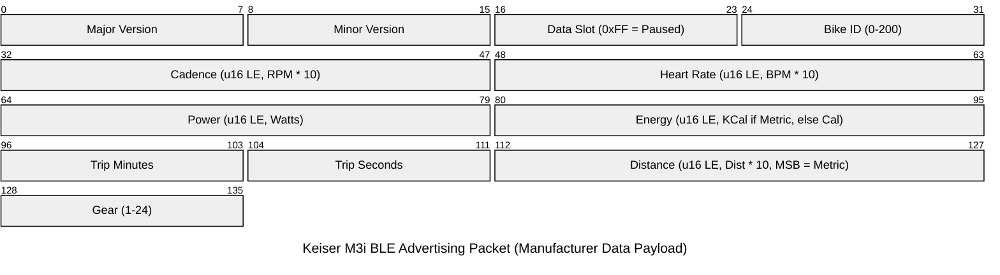

# Keiser M3i Bluetooth Protocol

The Keiser M3i sends its workout data in BLE advertising packets. The data is
in the Manufacturer Data field of the advertisement.

## Packet Structure

For firmware 6.21 and later, the Manufacturer Data payload is 17 bytes. All
multi-byte values are little-endian.

The bridge supports only this firmware, and only bikes that are set to metric
units. Packets from older firmware do not have the Gear byte at the end. The
bridge logs those packets as "old firmware not supported" and ignores them.
Packets with the imperial distance flag are logged as "imperial not supported"
and ignored.



### Data Fields Detail

- **Manufacturer ID**: `0x0102` (258). This is the Bluetooth SIG company
  identifier of Keiser Corporation. The bike uses only this id. On air, the id
  appears as the bytes `02 01` (little-endian, per Core Spec CSS Part A §1.4).
  BlueZ decodes the id and removes it. The payload that the parser receives
  starts at the firmware major byte. Keiser's simulator sends
  `... 14 FF 02 01 <17-byte payload>` ([`M3i_Sim.sh`](https://github.com/KeiserCorp/Keiser.M3i.BLE-HCI-Simulator)).
  This is the same, byte for byte, as the `btmon` captures in
  `sample-data.md`. See `KEISER_MANUFACTURER_ID` in `src/keiser.rs`.
- **Version**: Bytes 0 and 1 are the major and minor firmware versions. They
  are **BCD-encoded**: each nibble is one decimal digit. Thus `0x06 0x24` is
  firmware 6.24, and `0x21` means 21, not 33. Only these two bytes use BCD.
  All other fields are plain binary. Three Keiser sources confirm this:
  - Keiser's official parser, [`BuildValueConvert`](https://github.com/KeiserCorp/Keiser.MSeries.BLE-Parser/blob/master/Keiser.M3i.BLE-Parser/Parser.cs).
    It renders the byte as hex, then parses that string as decimal.
  - Keiser's [M Series Direct docs](https://dev.keiser.com/mseries/direct/).
    The parse example there reads byte `30` as 30, which is firmware 6.30.
  - Keiser's [M3i simulator](https://github.com/KeiserCorp/Keiser.M3i.BLE-HCI-Simulator),
    which sets `MAJOR="06" MINOR="24"`.

  Firmware 6.21 is the first build that adds the Gear byte. This is why the
  bridge accepts 6.21 and later.
- **Data Slot**: Byte 2. If this value is `0xFF`, the bike is paused.
- **Bike ID**: Byte 3. The ordinal id that is set on the bike (0-200). The
  bridge uses it to name the bike on both outputs: the BLE advertisement
  and DIS serial number, and the Home Assistant device and topics. See
  "Bike identity" in the README.
- **Cadence**: Bytes 4-5. The value is `RPM * 10`, little-endian.
- **Heart Rate**: Bytes 6-7. The value is `BPM * 10`, little-endian.
- **Power**: Bytes 8-9. Real-time power in watts, little-endian.
- **Energy**: Bytes 10-11. Accumulated energy, little-endian. The unit is
  kcal if the bike is metric, and Cal if the bike is imperial.
- **Trip Time**: Byte 12 is minutes. Byte 13 is seconds.
- **Distance**: Bytes 14-15. Bit 15 (the MSB of the 16-bit word) is the unit
  flag: `1` is metric, `0` is imperial. The bridge does not support imperial
  packets. The other 15 bits are `Distance * 10` in km.
- **Gear**: Byte 16. The current resistance level (1-24).

### Scanning Strategy

On Linux (BlueZ through `bluer`), the bridge scans continuously. The bike is a
BLE beacon: while a rider pedals, it advertises its current state without
stop. The OS can remove advertising packets that it thinks are duplicates. To
prevent this, the bridge restarts the scan every 60 seconds
(`SCAN_RESTART_INTERVAL` in `src/bluetooth_hal.rs`).

The bridge acts only on a change of the `ManufacturerData` property. This is
the one signal that carries a new advertisement. The bridge ignores
device-discovery events on purpose. When you read the properties of a device,
BlueZ returns its *cached* manufacturer data. The parser would then mark that
old reading as new, and reset the 20 s staleness clock with old data.

The discovery filter asks for `Transport::Le` and `DuplicateData: true`
(`discovery_filter()` in `src/scan_bluer.rs`). Both settings are necessary,
and both fail without an error if they are wrong. With `Auto`, interleaved
classic-Bluetooth inquiry loses approximately half of the packets. Without
duplicate data, bluetoothd does not send a `ManufacturerData` signal when the
payload is the same as before. That is exactly what happens when the bike is
paused. bluer's `DiscoveryFilter::default()` gets both settings wrong. This is
why the code sets them explicitly.

### Check if the periodic scan restart is still necessary

The restart is older than two changes that can make it unnecessary:

- The discovery filter requests `DuplicateData: true`. bluetoothd must then
  report *every* received advertisement, also identical ones.
- The adapter runs LE-only.

To check, do these steps:

1. Disable the restart. In `src/bluetooth_hal.rs`, set `SCAN_RESTART_INTERVAL`
   to a value that does not occur during a test ride. Example:
   `Duration::from_secs(24 * 60 * 60)`.
2. Build and deploy the change with `./deploy.sh`.
3. Ride for at least 10 minutes.
4. Measure the gaps between updates. Run this command on your development
   machine:

   ```bash
   ssh "$PI" "sudo journalctl -u m3i-ha-bridge --since '-15 min' --no-pager \
     | grep -E 'Bike [0-9]+ Update' | grep -oE '20[0-9-]+T[0-9:.]+' | python3 -c \"
   import sys, datetime
   ts = [datetime.datetime.fromisoformat(l.strip()) for l in sys.stdin]
   gaps = [round((b - a).total_seconds(), 1) for a, b in zip(ts, ts[1:])]
   print('updates:', len(ts), 'mean gap:', round(sum(gaps) / len(gaps), 2), 'max gap:', max(gaps))
   \""
   ```

   Compare the result with the healthy baseline. The baseline was measured on
   2026-07-18 *with* the restart active: mean gap approximately 2.1 s, maximum
   gap approximately 5 s. The bike advertises every 1.94 s.
5. Compare the first five minutes of the ride with the last five minutes. Do
   not compare only the overall mean. The failure that the restart prevents is
   decay: updates come at first, then become slower or stop as the scan
   continues.
6. Test the identical-payload case. Stop pedalling at the end of the ride.
   Make sure that `status="PAUSED"` updates continue to arrive in the journal
   every 2 s, approximately, while the bike broadcasts its end-of-ride summary.
   This is the case where BlueZ deduplication has an effect. While you ride,
   the payload changes with every packet (the trip-seconds byte), which hides
   any deduplication.
7. Decide:
   - If the update rate is stable for the full ride and through the paused
     phase, delete the restart timer. It is the `scan_restart_timer` branch of
     the `select!` in `create_bluetooth_event_stream`.
   - If updates stop until the time when a restart would have occurred, set
     `SCAN_RESTART_INTERVAL` back to 60 s. Then write here that the restart is
     still necessary.

If you are not sure that the radio receives the packets, run `sudo btmon` on
the Pi. It shows what the radio receives, independent of the bridge. Compare
its count of Keiser reports with the journal count for the same period.
